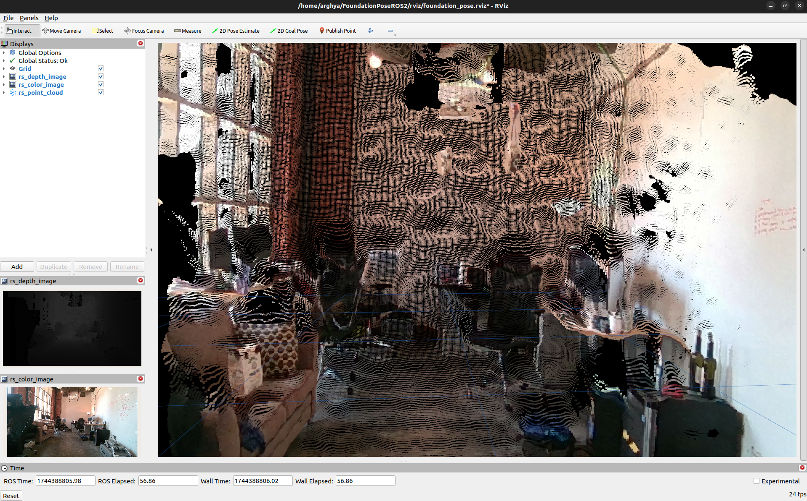

# Realsense Tutorial

This is a repository for all about realsense camera series (D435, D435i, D455 and D457).

Install the libraries:
```bash
# Install librealsense2
sudo apt install ros-humble-librealsense2*

# Install debian realsense2 package
sudo apt install ros-humble-realsense2-*
```
Launch the node:
```bash
source /opt/ros/humble/setup.bash 
ros2 launch realsense2_camera rs_launch.py enable_rgbd:=true enable_sync:=true align_depth.enable:=true enable_color:=true enable_depth:=true pointcloud.enable:=true
```
<div align="center">
  
</div>
