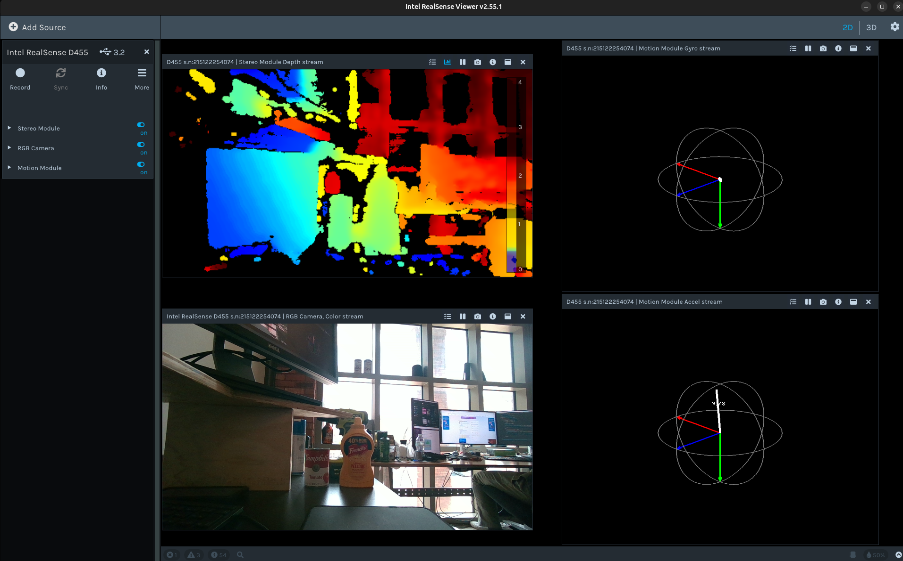
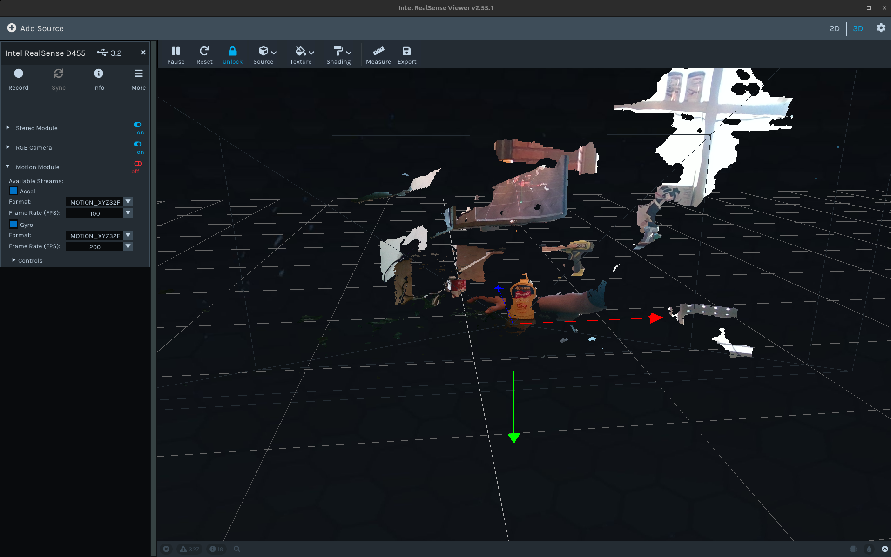

# Realsense Tutorial

This is a repository for all about realsense camera series (D435, D435i, D455 and D457) and realsense SDK version 2.53.1 (Java Support) and 2.55.1.

Install this irrespective of binary or source installation:

```bash
sudo apt update && sudo apt install -y \
  git \
  cmake \
  libssl-dev \
  libusb-1.0-0-dev \
  libudev-dev \
  pkg-config \
  libgtk-3-dev \
  libglfw3-dev \
  libgl1-mesa-dev \
  libglu1-mesa-dev \
  libopencv-dev \
  libcurl4-openssl-dev \
  python3-pip \
  python3-bloom \
  dh-make \
  debhelper \
  fakeroot
```

## Installation from Binaries

Follow this guideline to install from binaries from the official [website](https://github.com/IntelRealSense/librealsense/blob/master/doc/distribution_linux.md).

Register the server's public key:
```bash
sudo mkdir -p /etc/apt/keyrings
curl -sSf https://librealsense.intel.com/Debian/librealsense.pgp | sudo tee /etc/apt/keyrings/librealsense.pgp > /dev/null
```
Make sure apt HTTPS support is installed:
```bash
sudo apt-get install apt-transport-https
```
Add the server to the list of repositories:
```bash
echo "deb [signed-by=/etc/apt/keyrings/librealsense.pgp] https://librealsense.intel.com/Debian/apt-repo `lsb_release -cs` main" | \
sudo tee /etc/apt/sources.list.d/librealsense.list
sudo apt-get update
```
Install the libraries (see section below if upgrading packages):
```bash
sudo apt-get install librealsense2-dkms
sudo apt-get install librealsense2-utils
```
The above two lines will deploy librealsense2 udev rules, build and activate kernel modules, runtime library and executable demos and tools.

Optionally install the developer and debug packages:
```
sudo apt-get install librealsense2-dev
sudo apt-get install librealsense2-dbg
```
With dev package installed, you can compile an application with librealsense using g++ -std=c++11 filename.cpp -lrealsense2 or an IDE of your choice.

Reconnect the Intel RealSense depth camera and run: 
```
realsense-viewer 
```
This will verify the installation.

Verify that the kernel is updated :
```bash
modinfo uvcvideo | grep "version:" 
```
Should include realsense string.

<div align="center">
  
</div>

## Installation inside a docker
Follow this guideline from the official [website](https://github.com/IntelRealSense/librealsense/blob/master/doc/installation.md).

Install specific version of the libraries from source:
```
apt update
apt install git
cd ~
git clone https://github.com/IntelRealSense/librealsense.git -b v2.55.1
cd librealsense
mkdir build && cd build
cmake .. -DBUILD_EXAMPLES=true -DBUILD_GRAPHICAL_EXAMPLES=true
make -j$(nproc)
sudo make install
```
Run Intel Realsense permissions script from librealsense2 root directory:
```bash
cd librealsense
sudo apt install v4l-utils udev
./scripts/setup_udev_rules.sh
```
Installing ros libraries:
```
apt install ros-humble-librealsense2*
apt install ros-humble-realsense2-*
```

## Installation from Source

Follow this guideline from the official [website](https://github.com/IntelRealSense/librealsense/blob/master/doc/installation.md).

Install specific version of the libraries from source:
```
cd ~
git clone https://github.com/IntelRealSense/librealsense.git -b v2.55.1
cd librealsense
mkdir build && cd build
cmake .. -DBUILD_EXAMPLES=true -DBUILD_GRAPHICAL_EXAMPLES=true
make -j$(nproc)
sudo make install
```
Run Intel Realsense permissions script from librealsense2 root directory:
```bash
cd librealsense
sudo apt install v4l-utils
./scripts/setup_udev_rules.sh
```
Optional: You can always remove permissions by running: 
```
./scripts/setup_udev_rules.sh --uninstall
```

## Python libraries Installation:
```bash
pip install pyrealsense2
```
## ROS libraries Installation:
```bash
# Install librealsense2
sudo apt install ros-humble-librealsense2*

# Install debian realsense2 package
sudo apt install ros-humble-realsense2-*
```
Launch the realsense viewer:
```bash
realsense-viewer
```
<div align="center">
  
</div>

Launch the ROS2 node:
```bash
source /opt/ros/humble/setup.bash 
ros2 launch realsense2_camera rs_launch.py enable_rgbd:=true enable_sync:=true align_depth.enable:=true enable_color:=true enable_depth:=true pointcloud.enable:=true
```
<div align="center">
  
</div>

## ROS2 topics:
### Intel Realsense D457:
List all topics:
```
arghya@arghya:~$ ros2 topic list
/camera/camera/aligned_depth_to_color/camera_info
/camera/camera/aligned_depth_to_color/image_raw
/camera/camera/aligned_depth_to_color/image_raw/compressed
/camera/camera/aligned_depth_to_color/image_raw/compressedDepth
/camera/camera/aligned_depth_to_color/image_raw/ffmpeg
/camera/camera/aligned_depth_to_color/image_raw/theora
/camera/camera/color/camera_info
/camera/camera/color/image_raw
/camera/camera/color/image_raw/compressed
/camera/camera/color/image_raw/compressedDepth
/camera/camera/color/image_raw/ffmpeg
/camera/camera/color/image_raw/theora
/camera/camera/color/metadata
/camera/camera/depth/camera_info
/camera/camera/depth/color/points
/camera/camera/depth/image_rect_raw
/camera/camera/depth/image_rect_raw/compressed
/camera/camera/depth/image_rect_raw/compressedDepth
/camera/camera/depth/image_rect_raw/ffmpeg
/camera/camera/depth/image_rect_raw/theora
/camera/camera/depth/metadata
/camera/camera/extrinsics/depth_to_color
/camera/camera/extrinsics/depth_to_depth
/camera/camera/rgbd
/clicked_point
/goal_pose
/initialpose
/parameter_events
/rosout
/tf
/tf_static
```
Echo `/camera/camera/depth/image_rect_raw`:
```
arghya@arghya:~$ ros2 topic echo /camera/camera/depth/image_rect_raw 
header:
  stamp:
    sec: 1744741028
    nanosec: 684758545
  frame_id: camera_depth_optical_frame
height: 480
width: 640
encoding: 16UC1
is_bigendian: 0
step: 1280
data:
- 0
- 0
- 0
- 0
- 22
- 10
- 22
- 10
- 28
- 10
- 28
- 10
- 39
- 10
- 45
- 10
- 56
- 10
- 73
- 10
- 91
- 10
- 109
- 10
- 121
- 10
- 139
- 10
- 157
- 10
- 164
- 10
- 176
- 10
- 182
- 10
- 189
- 10
- 189
- 10
- 189
- 10
- 189
- 10
- 195
- 10
- 195
- 10
- 195
- 10
- 195
- 10
- 195
- 10
- 201
- 10
- 201
- 10
- 201
- 10
- 214
- 10
- 214
- 10
- 221
- 10
- 221
- 10
- 227
- 10
- 234
- 10
- 247
- 10
- 4
- 11
- 24
- 11
- 38
- 11
- 59
- 11
- 72
- 11
- 86
- 11
- '...'
```
Echo `/camera/camera/aligned_depth_to_color/image_raw`:

```
arghya@arghya:~$ ros2 topic echo /camera/camera/aligned_depth_to_color/image_raw 
header:
  stamp:
    sec: 1744740840
    nanosec: 995971924
  frame_id: camera_color_optical_frame
height: 480
width: 640
encoding: 16UC1
is_bigendian: 0
step: 1280
data:
- 0
- 0
- 0
- 0
- 0
- 0
- 0
- 0
- '...'
```
Echo `/camera/camera/depth/color/points`:
```
arghya@arghya:~$ ros2 topic echo /camera/camera/depth/color/points
header:
  stamp:
    sec: 1744741203
    nanosec: 965497070
  frame_id: camera_depth_optical_frame
height: 1
width: 246546
fields:
- name: x
  offset: 0
  datatype: 7
  count: 1
- name: y
  offset: 4
  datatype: 7
  count: 1
- name: z
  offset: 8
  datatype: 7
  count: 1
- name: rgb
  offset: 16
  datatype: 7
  count: 1
is_bigendian: false
point_step: 20
row_step: 4930920
data:
- 5
- 164
- 0
- 192
- 51
- 19
- 201
- 191
- 68
- 139
- 36
- 64
- 0
- 0
- 0
- 0
- 52
- 67
- 107
- 0
- 71
- 133
- 0
- 192
- 84
- 139
- 201
- 191
- 146
- 237
- 36
- 64
- 0
- 0
- 0
- 0
- 48
- 63
- 103
- 0
- 174
- 25
- 0
- 192
- 84
- 139
- 201
- 191
- 146
- 237
- 36
- 64
- 0
- 0
- 0
- 0
- 54
- 66
- 108
- 0
- 0
- 219
- 255
- 191
- 111
- 239
- 201
- 191
- 125
- 63
- 37
- 64
- 0
- 0
- 0
- 0
- 60
- 72
- 114
- 0
- '...'
is_dense: true
```
Echo `/camera/camera/color/image_raw`:
```
arghya@arghya:~$ ros2 topic echo /camera/camera/color/image_raw 
header:
  stamp:
    sec: 1744740700
    nanosec: 679577393
  frame_id: camera_color_optical_frame
height: 480
width: 640
encoding: rgb8
is_bigendian: 0
step: 1920
data:
- 122
- 86
- 76
- 117
- 81
- 71
- 117
- 81
- 71
- 118
- 82
- 72
- 124
- 86
- 75
- 125
- 87
- 76
- 133
- 92
- 82
- 135
- 94
- 84
- 134
- 92
- 80
- 132
- 90
- 78
- 136
- 89
- 78
- 137
- 90
- 79
- 131
- 82
- 72
- 125
- 76
- 66
- '...'
```
Echo `/camera/camera/color/camera_info`:
```
arghya@arghya:~$ ros2 topic echo /camera/camera/color/camera_info
header:
  stamp:
    sec: 1744741603
    nanosec: 114828613
  frame_id: camera_color_optical_frame
height: 480
width: 640
distortion_model: plumb_bob
d:
- -0.05422300472855568
- 0.062016744166612625
- 0.00011767349496949464
- 0.0008119725971482694
- -0.01983201690018177
k:
- 386.45025634765625
- 0.0
- 324.7872314453125
- 0.0
- 386.0099792480469
- 241.43978881835938
- 0.0
- 0.0
- 1.0
r:
- 1.0
- 0.0
- 0.0
- 0.0
- 1.0
- 0.0
- 0.0
- 0.0
- 1.0
p:
- 386.45025634765625
- 0.0
- 324.7872314453125
- 0.0
- 0.0
- 386.0099792480469
- 241.43978881835938
- 0.0
- 0.0
- 0.0
- 1.0
- 0.0
binning_x: 0
binning_y: 0
roi:
  x_offset: 0
  y_offset: 0
  height: 0
  width: 0
  do_rectify: false
```
Echo `/camera/camera/depth/camera_info`:
```
arghya@arghya:~$ ros2 topic echo /camera/camera/depth/camera_info
header:
  stamp:
    sec: 1744741706
    nanosec: 394741211
  frame_id: camera_depth_optical_frame
height: 480
width: 640
distortion_model: plumb_bob
d:
- 0.0
- 0.0
- 0.0
- 0.0
- 0.0
k:
- 392.40521240234375
- 0.0
- 324.7828674316406
- 0.0
- 392.40521240234375
- 239.76222229003906
- 0.0
- 0.0
- 1.0
r:
- 1.0
- 0.0
- 0.0
- 0.0
- 1.0
- 0.0
- 0.0
- 0.0
- 1.0
p:
- 392.40521240234375
- 0.0
- 324.7828674316406
- 0.0
- 0.0
- 392.40521240234375
- 239.76222229003906
- 0.0
- 0.0
- 0.0
- 1.0
- 0.0
binning_x: 0
binning_y: 0
roi:
  x_offset: 0
  y_offset: 0
  height: 0
  width: 0
  do_rectify: false
```
Echo `/camera/camera/aligned_depth_to_color/camera_info`:
```
arghya@arghya:~$ ros2 topic echo /camera/camera/aligned_depth_to_color/camera_info 
header:
  stamp:
    sec: 1744741795
    nanosec: 203161621
  frame_id: camera_color_optical_frame
height: 480
width: 640
distortion_model: plumb_bob
d:
- -0.05422300472855568
- 0.062016744166612625
- 0.00011767349496949464
- 0.0008119725971482694
- -0.01983201690018177
k:
- 386.45025634765625
- 0.0
- 324.7872314453125
- 0.0
- 386.0099792480469
- 241.43978881835938
- 0.0
- 0.0
- 1.0
r:
- 1.0
- 0.0
- 0.0
- 0.0
- 1.0
- 0.0
- 0.0
- 0.0
- 1.0
p:
- 386.45025634765625
- 0.0
- 324.7872314453125
- 0.0
- 0.0
- 386.0099792480469
- 241.43978881835938
- 0.0
- 0.0
- 0.0
- 1.0
- 0.0
binning_x: 0
binning_y: 0
roi:
  x_offset: 0
  y_offset: 0
  height: 0
  width: 0
  do_rectify: false
```
Echo `/camera/camera/color/metadata`:
```
arghya@arghya:~$ ros2 topic echo /camera/camera/color/metadata 
header:
  stamp:
    sec: 1744742180
    nanosec: 399325928
  frame_id: camera_color_optical_frame
json_data: '{"frame_number":24366,"clock_domain":"global_time","frame_timestamp":1744742180399.325928,"frame_counter":24366,"hw_timestamp":1...'
```
Echo `/camera/camera/depth/metadata`:
```
arghya@arghya:~$ ros2 topic echo /camera/camera/depth/metadata
header:
  stamp:
    sec: 1744742102
    nanosec: 4334717
  frame_id: camera_depth_optical_frame
json_data: '{"frame_number":23179,"clock_domain":"global_time","frame_timestamp":1744742102004.208984,"frame_counter":23179,"hw_timestamp":1...'
```
Echo `/camera/camera/extrinsics/depth_to_color`:
```
arghya@arghya:~$ ros2 topic echo /camera/camera/extrinsics/depth_to_color
rotation:
- 0.9999989867210388
- 0.0011255593271926045
- -0.0009012135560624301
- -0.0011257760925218463
- 0.9999993443489075
- -0.0002400263911113143
- 0.0009009428322315216
- 0.00024104070325847715
- 0.9999995827674866
translation:
- -0.05916818976402283
- -0.0001085121402866207
- 0.00032190384808927774
```
Echo `/camera/camera/extrinsics/depth_to_depth`:
```
arghya@arghya:~$ ros2 topic echo /camera/camera/extrinsics/depth_to_depth 
rotation:
- 1.0
- 0.0
- 0.0
- 0.0
- 1.0
- 0.0
- 0.0
- 0.0
- 1.0
translation:
- 0.0
- 0.0
- 0.0
---
```
Echo `/camera/camera/rgbd`:
```
arghya@arghya:~$ ros2 topic echo /camera/camera/rgbd
header:
  stamp:
    sec: 1744742365
    nanosec: 760612305
  frame_id: camera_rgbd_optical_frame
rgb_camera_info:
  header:
    stamp:
      sec: 1744742365
      nanosec: 760612305
    frame_id: camera_color_optical_frame
  height: 480
  width: 640
  distortion_model: plumb_bob
  d:
  - -0.05422300472855568
  - 0.062016744166612625
  - 0.00011767349496949464
  - 0.0008119725971482694
  - -0.01983201690018177
  k:
  - 386.45025634765625
  - 0.0
  - 324.7872314453125
  - 0.0
  - 386.0099792480469
  - 241.43978881835938
  - 0.0
  - 0.0
  - 1.0
  r:
  - 1.0
  - 0.0
  - 0.0
  - 0.0
  - 1.0
  - 0.0
  - 0.0
  - 0.0
  - 1.0
  p:
  - 386.45025634765625
  - 0.0
  - 324.7872314453125
  - 0.0
  - 0.0
  - 386.0099792480469
  - 241.43978881835938
  - 0.0
  - 0.0
  - 0.0
  - 1.0
  - 0.0
  binning_x: 0
  binning_y: 0
  roi:
    x_offset: 0
    y_offset: 0
    height: 0
    width: 0
    do_rectify: false
depth_camera_info:
  header:
    stamp:
      sec: 1744742365
      nanosec: 760612305
    frame_id: camera_depth_optical_frame
  height: 480
  width: 640
  distortion_model: plumb_bob
  d:
  - 0.0
  - 0.0
  - 0.0
  - 0.0
  - 0.0
  k:
  - 392.40521240234375
  - 0.0
  - 324.7828674316406
  - 0.0
  - 392.40521240234375
  - 239.76222229003906
  - 0.0
  - 0.0
  - 1.0
  r:
  - 1.0
  - 0.0
  - 0.0
  - 0.0
  - 1.0
  - 0.0
  - 0.0
  - 0.0
  - 1.0
  p:
  - 392.40521240234375
  - 0.0
  - 324.7828674316406
  - 0.0
  - 0.0
  - 392.40521240234375
  - 239.76222229003906
  - 0.0
  - 0.0
  - 0.0
  - 1.0
  - 0.0
  binning_x: 0
  binning_y: 0
  roi:
    x_offset: 0
    y_offset: 0
    height: 0
    width: 0
    do_rectify: false
rgb:
  header:
    stamp:
      sec: 1744742365
      nanosec: 760612305
    frame_id: camera_color_optical_frame
  height: 480
  width: 640
  encoding: rgb8
  is_bigendian: 0
  step: 1920
  data:
  - 4
  - 15
  - 11
  - 4
  - 15
  - 11
  - 5
  - 13
  - 10
  - 5
  - '...'
depth:
  header:
    stamp:
      sec: 1744742365
      nanosec: 760612305
    frame_id: camera_depth_optical_frame
  height: 480
  width: 640
  encoding: 16UC1
  is_bigendian: 0
  step: 1280
  data:
  - 0
  - 0
  - 0
  - 0
  - 0
  - '...'
```
Echo `/tf_static`:
```
arghya@arghya:~$ ros2 topic echo /tf_static 
transforms:
- header:
    stamp:
      sec: 1744740553
      nanosec: 266945954
    frame_id: camera_link
  child_frame_id: camera_depth_frame
  transform:
    translation:
      x: 0.0
      y: -0.0
      z: -0.0
    rotation:
      x: 0.0
      y: 0.0
      z: 0.0
      w: 1.0
- header:
    stamp:
      sec: 1744740553
      nanosec: 266945954
    frame_id: camera_depth_frame
  child_frame_id: camera_depth_optical_frame
  transform:
    translation:
      x: 0.0
      y: -0.0
      z: -0.0
    rotation:
      x: -0.5
      y: 0.4999999999999999
      z: -0.5
      w: 0.5000000000000001
- header:
    stamp:
      sec: 1744740553
      nanosec: 273695728
    frame_id: camera_link
  child_frame_id: camera_color_frame
  transform:
    translation:
      x: -0.00026857040938921273
      y: -0.05916853994131088
      z: -4.197920861770399e-05
    rotation:
      x: -0.0005628340295515954
      y: -0.00012026682088617235
      z: 0.0004505392862483859
      w: 0.9999997019767761
- header:
    stamp:
      sec: 1744740553
      nanosec: 273695728
    frame_id: camera_color_frame
  child_frame_id: camera_color_optical_frame
  transform:
    translation:
      x: 0.0
      y: -0.0
      z: -0.0
    rotation:
      x: -0.5
      y: 0.4999999999999999
      z: -0.5
      w: 0.5000000000000001
```
## 


