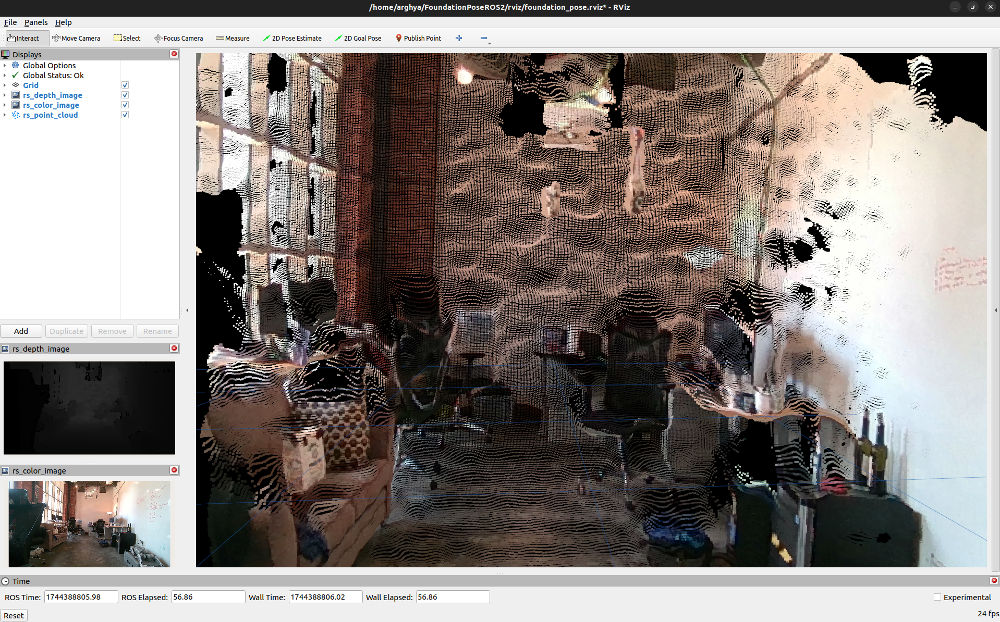

# Realsense Tutorial

This is a repository for all about realsense camera series (D435, D435i, D455 and D457).

Install the libraries:
```bash
# Install librealsense2
sudo apt install ros-humble-librealsense2*

# Install debian realsense2 package
sudo apt install ros-humble-realsense2-*
```
Launch the ROS2 node:
```bash
source /opt/ros/humble/setup.bash 
ros2 launch realsense2_camera rs_launch.py enable_rgbd:=true enable_sync:=true align_depth.enable:=true enable_color:=true enable_depth:=true pointcloud.enable:=true
```
<div align="center">
  
</div>

## ROS2 topics:
### Intel Realsense D457
List all topics:
```
arghya@arghya:~$ ros2 topic list
/camera/camera/aligned_depth_to_color/camera_info
/camera/camera/aligned_depth_to_color/image_raw
/camera/camera/aligned_depth_to_color/image_raw/compressed
/camera/camera/aligned_depth_to_color/image_raw/compressedDepth
/camera/camera/aligned_depth_to_color/image_raw/ffmpeg
/camera/camera/aligned_depth_to_color/image_raw/theora
/camera/camera/color/camera_info
/camera/camera/color/image_raw
/camera/camera/color/image_raw/compressed
/camera/camera/color/image_raw/compressedDepth
/camera/camera/color/image_raw/ffmpeg
/camera/camera/color/image_raw/theora
/camera/camera/color/metadata
/camera/camera/depth/camera_info
/camera/camera/depth/color/points
/camera/camera/depth/image_rect_raw
/camera/camera/depth/image_rect_raw/compressed
/camera/camera/depth/image_rect_raw/compressedDepth
/camera/camera/depth/image_rect_raw/ffmpeg
/camera/camera/depth/image_rect_raw/theora
/camera/camera/depth/metadata
/camera/camera/extrinsics/depth_to_color
/camera/camera/extrinsics/depth_to_depth
/camera/camera/rgbd
/clicked_point
/goal_pose
/initialpose
/parameter_events
/rosout
/tf
/tf_static
```
Echo `/camera/camera/aligned_depth_to_color/image_raw`:

```
arghya@arghya:~$ ros2 topic echo /camera/camera/aligned_depth_to_color/image_raw 
header:
  stamp:
    sec: 1744740840
    nanosec: 995971924
  frame_id: camera_color_optical_frame
height: 480
width: 640
encoding: 16UC1
is_bigendian: 0
step: 1280
data:
- 0
- 0
- 0
- 0
- 0
- 0
- 0
- 0
- '...'
```
Echo `/camera/camera/depth/image_rect_raw`:
```
arghya@arghya:~$ ros2 topic echo /camera/camera/depth/image_rect_raw 
header:
  stamp:
    sec: 1744741028
    nanosec: 684758545
  frame_id: camera_depth_optical_frame
height: 480
width: 640
encoding: 16UC1
is_bigendian: 0
step: 1280
data:
- 0
- 0
- 0
- 0
- 22
- 10
- 22
- 10
- 28
- 10
- 28
- 10
- 39
- 10
- 45
- 10
- 56
- 10
- 73
- 10
- 91
- 10
- 109
- 10
- 121
- 10
- 139
- 10
- 157
- 10
- 164
- 10
- 176
- 10
- 182
- 10
- 189
- 10
- 189
- 10
- 189
- 10
- 189
- 10
- 195
- 10
- 195
- 10
- 195
- 10
- 195
- 10
- 195
- 10
- 201
- 10
- 201
- 10
- 201
- 10
- 214
- 10
- 214
- 10
- 221
- 10
- 221
- 10
- 227
- 10
- 234
- 10
- 247
- 10
- 4
- 11
- 24
- 11
- 38
- 11
- 59
- 11
- 72
- 11
- 86
- 11
- '...'
```
Echo `/camera/camera/depth/color/points`:
```
arghya@arghya:~$ ros2 topic echo /camera/camera/depth/color/points
header:
  stamp:
    sec: 1744741203
    nanosec: 965497070
  frame_id: camera_depth_optical_frame
height: 1
width: 246546
fields:
- name: x
  offset: 0
  datatype: 7
  count: 1
- name: y
  offset: 4
  datatype: 7
  count: 1
- name: z
  offset: 8
  datatype: 7
  count: 1
- name: rgb
  offset: 16
  datatype: 7
  count: 1
is_bigendian: false
point_step: 20
row_step: 4930920
data:
- 5
- 164
- 0
- 192
- 51
- 19
- 201
- 191
- 68
- 139
- 36
- 64
- 0
- 0
- 0
- 0
- 52
- 67
- 107
- 0
- 71
- 133
- 0
- 192
- 84
- 139
- 201
- 191
- 146
- 237
- 36
- 64
- 0
- 0
- 0
- 0
- 48
- 63
- 103
- 0
- 174
- 25
- 0
- 192
- 84
- 139
- 201
- 191
- 146
- 237
- 36
- 64
- 0
- 0
- 0
- 0
- 54
- 66
- 108
- 0
- 0
- 219
- 255
- 191
- 111
- 239
- 201
- 191
- 125
- 63
- 37
- 64
- 0
- 0
- 0
- 0
- 60
- 72
- 114
- 0
- '...'
is_dense: true
```
Echo `/camera/camera/color/image_raw`:
```
arghya@arghya:~$ ros2 topic echo /camera/camera/color/image_raw 
header:
  stamp:
    sec: 1744740700
    nanosec: 679577393
  frame_id: camera_color_optical_frame
height: 480
width: 640
encoding: rgb8
is_bigendian: 0
step: 1920
data:
- 122
- 86
- 76
- 117
- 81
- 71
- 117
- 81
- 71
- 118
- 82
- 72
- 124
- 86
- 75
- 125
- 87
- 76
- 133
- 92
- 82
- 135
- 94
- 84
- 134
- 92
- 80
- 132
- 90
- 78
- 136
- 89
- 78
- 137
- 90
- 79
- 131
- 82
- 72
- 125
- 76
- 66
- '...'
```


